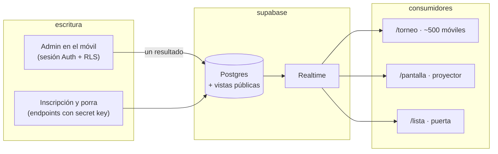

# Beerpong IV

Plataforma web completa de un torneo real de beer pong: inscripción, sorteo, resultados en
directo, porra, pantalla de proyector y control de puerta. Se juega el 6 de agosto en Cabra del
Santo Cristo (Jaén), dentro del programa oficial de fiestas.

**51 equipos · 13 grupos · 6 mesas · ~500 asistentes · 1.200+ visitas antes del evento**


---

- [El problema](#el-problema)
- [Qué hace](#qué-hace)
- [Arquitectura y decisiones](#arquitectura-y-decisiones)
- [El formato del torneo](#el-formato-del-torneo)
- [Puesta en marcha](#puesta-en-marcha)
- [Estructura del proyecto](#estructura-del-proyecto)
- [Qué aprendí](#qué-aprendí)

## El problema

Esto no es un CRUD con esteroides; es una noche en vivo con restricciones muy concretas:

- **Un solo organizador mete todos los resultados desde el móvil**, de pie, con ruido, mientras
  hace también de DJ y de MC. Cada pantalla del panel está pensada para pulgares con prisa:
  botones grandes, confirmaciones solo donde algo es irreversible, y ninguna operación que
  dependa de acertar a la primera.
- **~500 personas con la web abierta a la vez** siguiendo la clasificación, el cuadro y la porra.
  Todas esperan ver el resultado segundos después de que caiga el último vaso.
- **Un fallo delante de todo el pueblo es irrecuperable.** No hay ventana de mantenimiento ni
  "vuelve a intentarlo mañana". De ahí la decisión de diseño más importante del panel: **todo se
  puede corregir** — un marcador mal metido, un grupo cerrado antes de tiempo, una ronda entera
  que hay que regenerar — por encima de cualquier otra consideración.

## Qué hace

Cinco superficies sobre la misma base de datos, cada una con su trabajo:

| Ruta | Qué resuelve |
| --- | --- |
| `/` | Landing pública: inscripción con contador de plazas en vivo y lista de espera automática al llenarse el cupo. Historia de las ediciones con galería. |
| `/torneo` | La web del público durante la noche: porra, ranking de acertantes, clasificación de los 13 grupos y cuadro eliminatorio, todo en tiempo real. Es la que usan los ~500. |
| `/admin` | La cabina de mando, hecha para el móvil: sorteo de grupos, resultados, generación y confirmación de rondas, control de la porra. Con red de seguridad completa: corregir, deshacer, regenerar. |
| `/pantalla` | Display autónomo para el proyector. Decide solo qué mostrar según el estado del torneo (bienvenida → clasificación → cuenta atrás de la porra → cuadro → marcador de la final → campeón). Se abre al principio y no se vuelve a tocar. |
| `/lista` | Control de entrada en la puerta: buscar al equipo, marcar «ya dentro», deshacer. Persistente y sincronizado entre varios móviles. |

## Arquitectura y decisiones

Lo interesante no es el stack, es por qué cada pieza está donde está.

**Astro con islas React.** Casi toda la web es HTML estático prerenderizado; React solo se carga
donde hay interacción real (el panel, la vista del torneo, la pantalla). Resultado: la landing
puntúa 93–99 en PageSpeed con fuentes propias, galería y animaciones incluidas.

**Lecturas directas a Supabase, por Realtime.** Los ~500 móviles se suscriben a los cambios de
Postgres y releen las vistas públicas cuando algo cambia. No hay backend propio que machacar ni
que tumbar: el "servidor" de las lecturas es Supabase, y escala solo. Como red de seguridad, cada
cliente refresca cada 30 s (solo con la pestaña visible) y la pantalla del proyector añade wake
lock y reconexión con espera exponencial: ante cualquier fallo conserva lo último bueno.

**Escrituras públicas por endpoints de servidor.** El navegador nunca escribe directo en las
tablas: la inscripción y la porra pasan por `/api/*`, que valida y escribe con la secret key. El
panel es la excepción controlada: escribe con sesión de Supabase Auth y las políticas RLS solo
abren esas tablas al rol `authenticated`.

**Vistas públicas que exponen solo lo necesario.** `equipos_publicos`, `ranking_porra` y
`porra_stats` son lo único que lee el navegador. Los teléfonos de los participantes viven en la
tabla privada y no salen de ahí; el ranking expone motes y puntos, nunca picks ni hashes.

**Porra sin registro.** Mote + PIN, con el PIN en bcrypt y verificado en servidor en cada
escritura. Nadie da su email para jugarse un bonocopas, y el proyecto no custodia datos
personales de 60 personas que no necesita.

**Máquina de estados.** El estado del torneo vive en la base de datos (grupos, partidos, fases) y
de él se deriva todo: qué paso toca en el panel, qué muestra el proyector, cuándo se cierra cada
porra. Ninguna superficie guarda estado propio que pueda desincronizarse.

**Sin `edicion_id`.** Decisión consciente: es un evento anual y multi-edición habría impuesto un
join a cada consulta y un filtro a cada pantalla durante todo el desarrollo. El año que viene se
archiva y se resetea.

El flujo de datos completo — una escritura, tres consumidores:



Un solo `UPDATE` de un partido actualiza a la vez la clasificación del grupo, el cuadro y los
puntos de la porra en todos los dispositivos.

## El formato del torneo

Condiciona todo el código, así que conviene tenerlo delante:

- **13 grupos**: 12 de 4 equipos y el grupo M de 3, que juega antes (18:30, en dos mesas) porque
  el cupo cerró en 51.
- **6 mesas y dos turnos**: grupos A–F a las 19:00, G–L a las 20:00. La mesa de cada grupo se
  deriva de su orden dentro del turno; nada de asignaciones a mano.
- **Clasifican 32**: el 1º y el 2º de cada grupo (26) más los **6 mejores terceros**. El tercero
  de un grupo de 3 no compite por esas plazas: juega un partido menos y sus números no son
  comparables — la condición es por tamaño de grupo, dinámica, nunca por letra.
- **Siembra por ranking**: el mejor clasificado contra el 32º, el 2º contra el 31º… y plegado de
  rondas (dieciseisavos → octavos → cuartos → semifinales → final) hasta el campeón.
- Los desempates de grupo, en este orden: puntos → diferencia de vasos → vasos a favor
  (`src/lib/clasificacion.ts`, la misma función en el panel y en las vistas públicas).

## Puesta en marcha

Requisitos: **Node 22.12+** y un proyecto de Supabase.

```sh
git clone <repo>
cd beerpong-iv
npm install
cp .env.example .env   # y rellenar
npm run dev
```

Variables de entorno (`.env.example` documenta las tres):

| Variable | Qué es | ¿Llega al navegador? |
| --- | --- | --- |
| `PUBLIC_SUPABASE_URL` | URL del proyecto Supabase | Sí (prefijo `PUBLIC_`) |
| `PUBLIC_SUPABASE_PUBLISHABLE_KEY` | Clave de cliente: solo puede leer lo que el RLS y las vistas públicas permiten | Sí |
| `SUPABASE_SECRET_KEY` | Clave de servidor: la usan solo los endpoints `/api/*`. **Nunca** debe llevar prefijo `PUBLIC_` | No |

El esquema (tablas, restricciones y vistas) está documentado en `supabase/schema.sql`; la base de
datos real se gestiona en Supabase con RLS y Realtime ya configurados. En `db/` hay SQL puntual
(el grupo M, el contador de lista de espera).

Para la galería de la landing: deja las fotos originales en `fotos-originales/` (ignorada en git;
admite JPG, PNG, WebP y RAW CR2) y ejecuta `node scripts/optimizar-galeria.mjs` — genera las
versiones optimizadas con `sharp` y reescribe solo el índice `src/lib/galeria.ts`, conservando
los pies de foto ya escritos.

## Estructura del proyecto

```text
src/
├── pages/
│   ├── index.astro          # landing (estática, GSAP solo aquí)
│   ├── torneo.astro         # la web del público
│   ├── admin.astro          # cabina de mando
│   ├── pantalla.astro       # proyector autónomo
│   ├── lista.astro          # control de entrada
│   └── api/
│       ├── inscribir.ts     # alta pública → secret key en servidor
│       ├── porra/           # alta, login y picks (mote + PIN bcrypt)
│       └── admin/regenerar.ts
├── components/
│   ├── torneo/ admin/ pantalla/ lista/   # islas React, una carpeta por superficie
│   └── *.astro                           # secciones estáticas de la landing
├── lib/
│   ├── clasificacion.ts     # standings, desempates y mejores terceros
│   ├── horarios.ts          # horas y mesas DERIVADAS del formato, nunca a mano
│   └── supabase.ts          # cliente publishable compartido (singleton)
└── styles/                  # un CSS por superficie, mismos tokens de marca

supabase/schema.sql          # instantánea documentada del esquema
db/                          # SQL puntual (grupo M, contador de espera)
scripts/optimizar-galeria.mjs
```

## Qué aprendí

- **La red de seguridad del panel fue lo más valioso que se construyó.** Cada hora invertida en
  «corregir», «deshacer» y «regenerar» se amortiza la primera vez que un resultado entra mal con
  el pabellón lleno. Las features se lucen; la reversibilidad salva la noche.
- **El ensayo completo en staging destapó fallos que no se veían leyendo código.** Simular el
  torneo entero — sorteo, 106 partidos, porra, final — sacó a la luz casos (columnas que faltaban,
  vistas que no cabían en el proyector, totales imposibles) que ninguna revisión estática habría
  encontrado.
- **Decir que no importó tanto como lo que sí se hizo.** No a Turso, no a los emails
  transaccionales, no al multi-edición, no a features de más. Cada «no» fue menos superficie que
  probar, asegurar y mantener antes de una fecha que no se movía.
